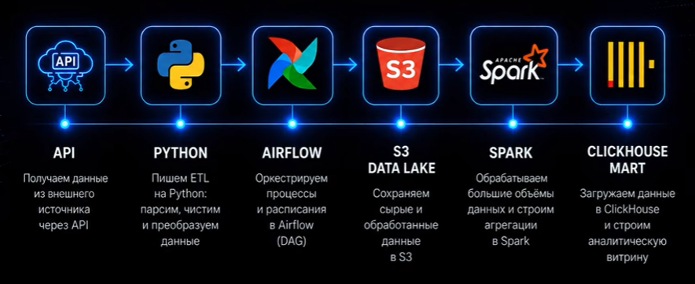

# Data Pipeline Example (API -> ClickHouse)

Учебный проект на реальных данных: от внешнего API до аналитической витрины в ClickHouse.



| Этап | Инструмент | Что делает в проекте |
|---|---|---|
| API | [Open-Meteo](https://open-meteo.com/) | Почасовая погода по 20 городам, бесплатно и без ключа |
| Python | `src/p1` | Extract (запросы с retry), парсинг, очистка, Parquet, DQ-проверки |
| Airflow 3.3 | `dags/` | Оркестрация: ежедневный DAG и backfill с dynamic task mapping |
| S3 Data Lake | MinIO | Слои `raw/` (JSON), `staging/` (Parquet по часам), `mart/` (Parquet по дням) |
| Spark 4.1 | `spark/jobs/` | Standalone-кластер (master + 2 worker'а): дневные агрегаты, 30-дневная норма через оконную функцию |
| ClickHouse 26.8 | `clickhouse/` | Витрина `weather.daily_city` (ReplacingMergeTree), загрузка напрямую из S3 |

## Архитектура

```
                    ┌──────────────────────── Airflow (LocalExecutor) ─────────────────────────┐
Open-Meteo API ──►  │ extract ─► transform ─► dq_staging ─► spark_aggregate ─► load ─► dq_mart  │
                    └───┬───────────┬────────────────────────────┬──────────────────┬──────────┘
                        ▼           ▼                            ▼                  ▼
                  MinIO raw/   MinIO staging/  ──(s3a)──►  Spark cluster  ──►  MinIO mart/ ──(s3())──► ClickHouse
                   JSON         Parquet, по часам          master + 2 workers   Parquet, по дням        weather.daily_city
```

Подробности:
- **Extract**: 1 HTTP-запрос = 1 город × 1 месяц (backfill) или × 1 день (daily). При 429 и 5xx запрос повторяется с экспоненциальной задержкой (tenacity).
- **Transform**: колоночный JSON разворачивается в строки (город, час), затем типы, UTC, дедупликация. Результат пишется в Parquet по одному файлу на день.
- **DQ staging**: у каждого города 24 часа, все города на месте, нет дублей, значения в физических диапазонах, пропусков не больше 5%.
- **Spark**: часы сворачиваются в дни (min, max, avg, sum). `temp_norm_30d` равна средней температуре за 30 предыдущих дней (`Window.rangeBetween(-30, -1)`), `temp_anomaly` равна отклонению от неё. Запись идёт с динамической перезаписью партиций.
- **Load**: ClickHouse сам читает Parquet из MinIO (`INSERT … SELECT FROM s3(...)`), данные не проходят через Airflow.
- **DQ mart**: `строк = города × дни`, `temp_min ≤ temp_avg ≤ temp_max`, у всех строк полные сутки.

Каждый шаг идемпотентен: любой период можно перезапустить без дублей.

## Быстрый старт

Требования: Docker Desktop, у WSL2 **не меньше 10–12 ГБ RAM** (`%USERPROFILE%\.wslconfig` → `[wsl2]` `memory=12GB`), около 8 ГБ на диске.

```powershell
# 1. Поднять стек (при первом запуске: сборка образа Airflow и загрузка jar'ов ~640 МБ)
.\scripts\p1.ps1 up

# 2. Проверить, что всё healthy
.\scripts\p1.ps1 status

# 3. Тесты
.\scripts\p1.ps1 test

# 4. Загрузить историю (например, за 3 года: ~740 запросов к API, ~10 минут)
.\scripts\p1.ps1 backfill 2023-10-01 2026-10-08

# 5. Посмотреть результат
.\scripts\p1.ps1 chfile clickhouse\queries\02_climate_by_city.sql
```

DAG `weather_daily` включён сразу и каждый день в 03:00 UTC загружает вчерашний день.

Если PowerShell не даёт запускать скрипты: `Set-ExecutionPolicy -Scope CurrentUser RemoteSigned`.

## Что смотреть в UI

| UI | Адрес | На что обратить внимание |
|---|---|---|
| Airflow | http://localhost:8080 (без логина) | Grid: mapped-задачи `extract [37]`; Graph: зависимости; логи задач; форма параметров у `weather_backfill` |
| Spark Master | http://localhost:8081 | 2 worker'а по 2 ядра; Completed Applications; executors на обоих worker'ах |
| Spark job | http://localhost:4040 | Только пока job работает: стадии, shuffle, план запроса (вкладка SQL) |
| MinIO | http://localhost:9001 (`minioadmin` / `minioadmin123`) | Bucket `datalake`, раскладка `dt=YYYY-MM-DD/` |
| ClickHouse | http://localhost:8123/play (`p1` / `p1pass`) | SQL по витрине, примеры в `clickhouse/queries/` |

DBeaver: ClickHouse, хост `localhost`, порт `8123` (HTTP), пользователь `p1`.

## Команды `scripts/p1.ps1`

| Команда | Что делает |
|---|---|
| `up` | Собрать образ (если изменился) и поднять стек |
| `stop [сервис]` / `start [сервис]` | Приостановить и снова запустить стек или отдельный сервис. Контейнеры не удаляются |
| `down` | Остановить стек и удалить контейнеры (данные в томах сохраняются) |
| `reset` | Остановить и удалить все данные (тома), спрашивает подтверждение |
| `build` | Пересобрать образ Airflow |
| `status` | Контейнеры и последние запуски DAG'ов |
| `test` | pytest в контейнере Airflow |
| `backfill <start> <end>` | Запуск `weather_backfill` |
| `daily` | Внеплановый запуск `weather_daily` |
| `runs [dag_id]` | Список запусков DAG'а |
| `ch "<SQL>"` / `chfile <file.sql>` | Запрос к ClickHouse |
| `s3 [prefix]` | Размер и содержимое слоёв в MinIO |
| `logs [service]` | Логи сервиса |

## Структура

```
docker-compose.yml          весь стек: postgres, minio, spark (master + 2 workers), clickhouse, airflow
docker/airflow/             образ Airflow: + Java 17, pyspark 4.1.3, провайдер Spark, clickhouse-connect
config/cities.yaml          список городов
src/p1/                     логика ETL (тестируемая, без зависимости от Airflow)
dags/                       weather_daily, weather_backfill, p1_common (общая цепочка задач)
spark/jobs/                 Spark job агрегатов
clickhouse/init|queries/    схема витрины и примеры аналитики
tests/                      pytest (без сети и внешних сервисов)
scripts/                    p1.ps1 (управление), trigger_dag.sh (запуск DAG'а с параметрами)
```

## Почему так устроено

- **Python 3.10 в Airflow**: PySpark требует одинаковой версии Python на driver'е (контейнер Airflow) и на executor'ах (образ `apache/spark:4.1.3` поставляется с 3.10).
- **Jar'ы S3A в отдельном томе**: `hadoop-aws` требует AWS SDK bundle весом 640 МБ. Он скачивается один раз и подключается к driver'у и executor'ам через `extraClassPath`.
- **MinIO из `pgsty/minio`**: официальные Docker-образы MinIO больше не публикуются, а community-сборка совместима с ними.
- **ReplacingMergeTree + FINAL**: простой способ сделать загрузку идемпотентной без удаления данных.
- **Месячные куски в backfill**: укладываемся в лимиты Open-Meteo (10k запросов в сутки) и получаем параллелизм через `expand()`.

## Упражнения для самостоятельной практики

1. Добавить город в `config/cities.yaml` и перезагрузить последний месяц. Как изменится `dq_mart`, если не перезагружать остальную историю?
2. Добавить переменную `apparent_temperature` (ощущаемая температура): API → transform → Spark → ClickHouse (`ALTER TABLE ... ADD COLUMN`).
3. Сломать данные: положить в staging файл с температурой 99 °C и посмотреть, как упадёт `dq_staging`.
4. Сделать вторую витрину `weather.monthly_city` материализованным представлением ClickHouse поверх `daily_city`.
5. Сравнить время Spark job с одним и двумя worker'ами (`docker compose stop spark-worker-2`).
6. Посмотреть в Spark UI → SQL план запроса: где происходит partition pruning и где shuffle.
7. Заменить Python transform на Spark job и сравнить подходы.
